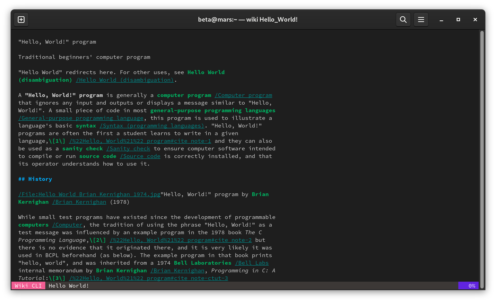

# Wiki CLI [](https://github.com/BetaPictoris/wiki/actions/workflows/build.yml)

View Wikipedia articles through the CLI



## Installation

### From release

```bash
curl -LO https://github.com/BetaPictoris/wiki/releases/latest/download/wiki    # Download the latest binary.
sudo install -Dt /usr/local/bin -m 755 wiki                                    # Install Wiki CLI to "/usr/local/bin" with the mode "755"
```

### Build from source

#### Dependencies

You need Go (1.19+) installed to build this program. You can install it from your distro's repository using one of the following commands:

```bash
# Arch/Manjaro (and derivatives)
sudo pacman -Syu go

# Debian/Ubuntu (and derivatives)
sudo apt install golang-go
```

Alternatively, you can install it from go's official website: [go.dev/doc/install](https://go.dev/doc/install)

Then, to build & install wiki run:

```bash
git clone git@github.com:BetaPictoris/wiki.git      # Clone the repository
cd wiki                                             # Change into the repository's directory
make                                                # Build Wiki CLI
sudo make install                                   # Install Wiki CLI to "/usr/local/bin" with the mode "755"
```

### From a package manager

#### [IndiePKG](https://github.com/talwat/indiepkg)

```bash
indiepkg install wiki
```

### User install

If you don't have access to `sudo` on your system you can install to your user's `~/.local/bin` directory with this command: 

```bash
install -Dt ~/.local/bin -m 755 wiki
```
